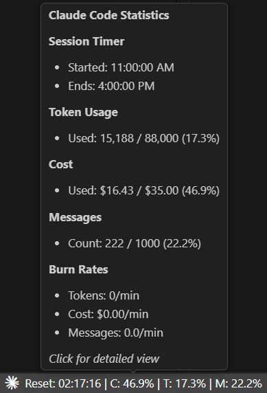
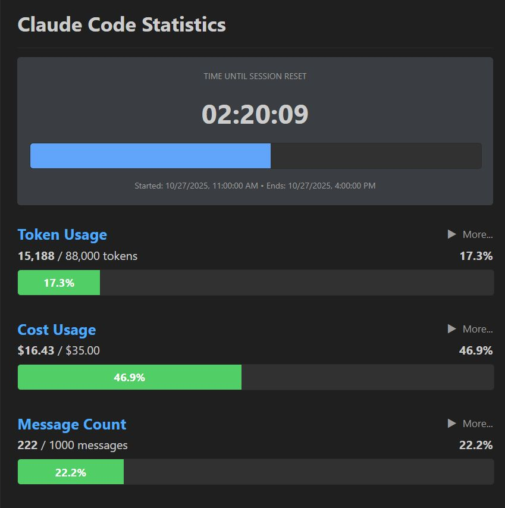
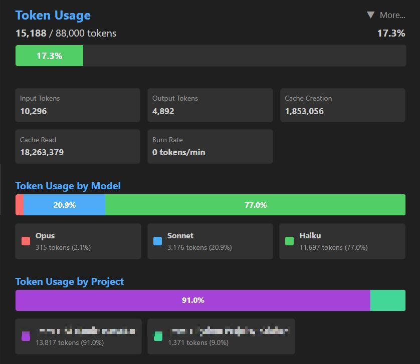

<div align="center">
  <h1>Claude Code Status Bar Monitor</h1>
  <p>A VS Code extension that displays real-time Claude Code usage statistics directly in your status bar.</p>
</div>

## 📊 Status Bar & Tooltip

The extension automatically starts monitoring when you open VS Code. The status bar shows real-time usage with color-coded warnings based on token usage:

```
Reset: 03:45:12 | C: 35.9% | T: 74.4% | M: 25.5%
```

**Status Bar Components:**
- **Reset**: Countdown timer to session reset (HH:MM:SS)
- **C**: Cost usage percentage
- **T**: Token usage percentage
- **M**: Message count percentage

**Color Indicators:**
- ⚪ Neutral: < 75% of token limit
- 🟠 Orange: 75-89% of token limit
- 🔴 Red: ≥ 90% of token limit

**Hover over the status bar** to see a quick tooltip with session timing and key metrics:

<div align="center">
  
  <p><em>Tooltip showing quick overview: session timer, token usage, cost, message count, and burn rates</em></p>
</div>

## 🎨 Detailed Popup & Advanced Analytics

Click the status bar to open the main popup with comprehensive metrics:

<div align="center">
  
  <p><em>Main popup view with session timer, token usage, cost tracking, and message count with visual progress bars</em></p>
</div>

**Main Popup includes:**
- Progress bars for tokens, cost, and messages
- Percentage indicators
- Per-minute consumption rates (tokens/min, $/min, messages/min)
- Session timing information
- Token breakdown (input, output, cache creation, cache read)

**Advanced Analytics** - Click "More..." buttons to access detailed breakdowns:

<div align="center">
  
  <p><em>Expanded view showing token breakdown by component, usage by model (Opus/Sonnet/Haiku), and usage by project</em></p>
</div>

**Extended information includes:**
- **Token Components**: Individual counts of input, output, cache creation, and cache read tokens
- **Burn Rate Analysis**: Real-time token and cost consumption rates (tokens/min, $/min)
- **Model Breakdown**: Pie chart showing which models (Opus, Sonnet, Haiku) consumed the most tokens
- **Project Breakdown**: Visualization of token usage across different Claude projects

## ⚙️ Configuration

Simple configuration with just two settings:
1. **Plan**: Choose from Pro, Max5, Max20, or Custom
2. **Refresh Interval**: Update frequency (1-60 seconds)

### VS Code Settings

```json
{
  "claudeStatusBar.plan": "max5",              // pro, max5, max20, or custom
  "claudeStatusBar.customTokenLimit": 44000,   // Only for custom plan
  "claudeStatusBar.refreshInterval": 5          // 1-60 seconds
}
```

### Plan Limits

| Plan | Token Limit | Cost Limit | Message Limit |
|------|-------------|------------|---------------|
| **Pro** | 19,000 | $18.00 | 250 |
| **Max5** | 88,000 | $35.00 | 1,000 |
| **Max20** | 220,000 | $140.00 | 2,000 |
| **Custom** | User-defined | $50.00 | 250 |

## Installation

### Via VS Code Extension Manager

1. Open VS Code
2. Go to Extensions (`Ctrl+Shift+X` / `Cmd+Shift+X`)
3. Search for "Claude Code Status Bar Monitor"
4. Click **Install**

Or visit the [VS Code Marketplace page](https://marketplace.visualstudio.com/items?itemName=bartosz-warzocha.claude-statusbar)

### Manual Installation

```bash
npm install
npm run package
code --install-extension claude-statusbar-0.1.0.vsix
```

## Usage & Commands

Access via Command Palette (`Ctrl+Shift+P` / `Cmd+Shift+P`):

- `Claude: Show Usage Details` - Open detailed metrics popup
- `Claude: Set Plan to Pro` - Switch to Pro plan (19k tokens)
- `Claude: Set Plan to Max5` - Switch to Max5 plan (88k tokens)
- `Claude: Set Plan to Max20` - Switch to Max20 plan (220k tokens)
- `Claude: Set Plan to Custom` - Set custom token limit
- `Claude: Refresh Usage Stats` - Force refresh metrics

## How It Works

### Data Source

Claude Code stores conversation data locally in JSONL files:

- **Windows**: `%USERPROFILE%\.claude\projects\`
- **macOS/Linux**: `~/.claude/projects/` or `~/.config/claude/projects/`

The extension monitors these files for changes and calculates metrics in real-time.

### Session Windows

Claude Code uses **5-hour rolling sessions**. The extension:

1. Detects your first message timestamp
2. Calculates session expiry (5 hours later)
3. Tracks usage within the active window
4. Automatically resets when session expires

### Token Calculation

**What counts toward limits:**

- ✅ `input_tokens` - Your prompts
- ✅ `output_tokens` - Claude's responses

**What doesn't count toward token limits:**

- ❌ `cache_creation_input_tokens` - Cache overhead
- ❌ `cache_read_input_tokens` - Cache hits

**Note:** Cache tokens ARE included in cost calculations but NOT in token limits.

### Cost Calculation

Costs are calculated using model-specific pricing:

| Model | Input | Output | Cache Creation | Cache Read |
|-------|-------|--------|----------------|------------|
| **Opus** | $15.00/M | $75.00/M | $18.75/M | $1.50/M |
| **Sonnet** | $3.00/M | $15.00/M | $3.75/M | $0.30/M |
| **Haiku** | $0.25/M | $1.25/M | $0.30/M | $0.03/M |

> Pricing per million tokens

## Privacy

All data processing happens **locally on your machine**:

- ✅ No data sent to external servers
- ✅ No telemetry or analytics
- ✅ No account required
- ✅ Reads only your local Claude files

## Requirements

- **VS Code**: 1.104.0 or higher
- **Claude Code**: Active installation with local conversation data
- **Node.js**: Only for development

## Development

### Building

```bash
npm install
npm run compile
```

### Watch Mode

```bash
npm run watch
```

### Packaging

```bash
npm run package
vsce package
```

### Testing

```bash
npm run test
```

## Credits & Inspiration

This project was inspired by and built upon the excellent work of:

### GUI & Architecture

- **[yahyashareef48/claude-usage-monitor](https://github.com/yahyashareef48/claude-usage-monitor)** - Visual design and VS Code extension architecture
  - Status bar layout and styling
  - Webview panel implementation
  - Real-time file watching approach

### Calculation Logic & Accuracy

- **[Maciek-roboblog/Claude-Code-Usage-Monitor](https://github.com/Maciek-roboblog/Claude-Code-Usage-Monitor)** - Precise usage calculations
  - Token counting methodology (excluding cache tokens from limits)
  - Cost calculation formulas with model-specific pricing
  - 5-hour rolling session window logic
  - P90-based custom plan analysis

**Note:** This extension combines the best of both projects - accurate calculations from Maciek's monitor with the polished GUI from Yahya's extension.

## License

MIT License - see [LICENSE](LICENSE) file for details.

## Support

For issues or feature requests, please visit the [GitHub repository](https://github.com/bartoszwarzocha/claude_statusbar).

---

**Enjoy monitoring your Claude Code usage!** 🚀
